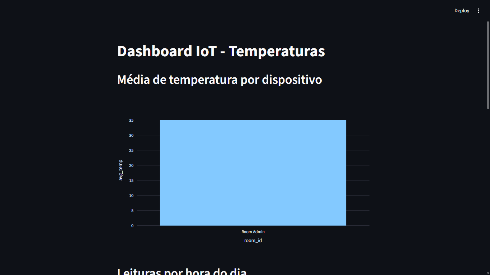
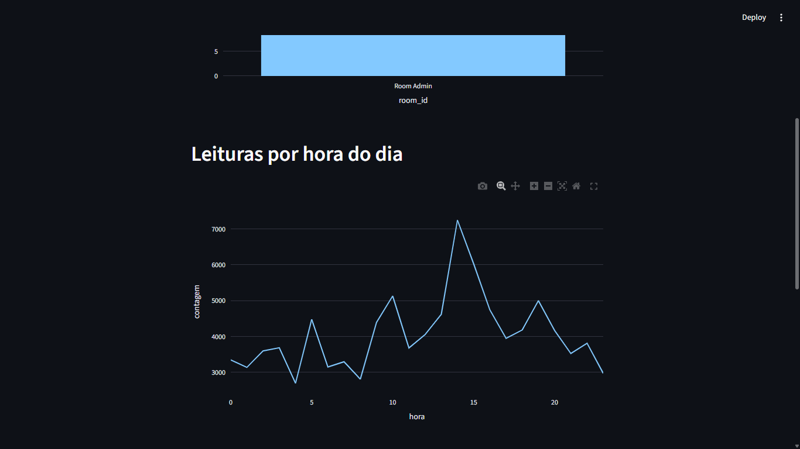
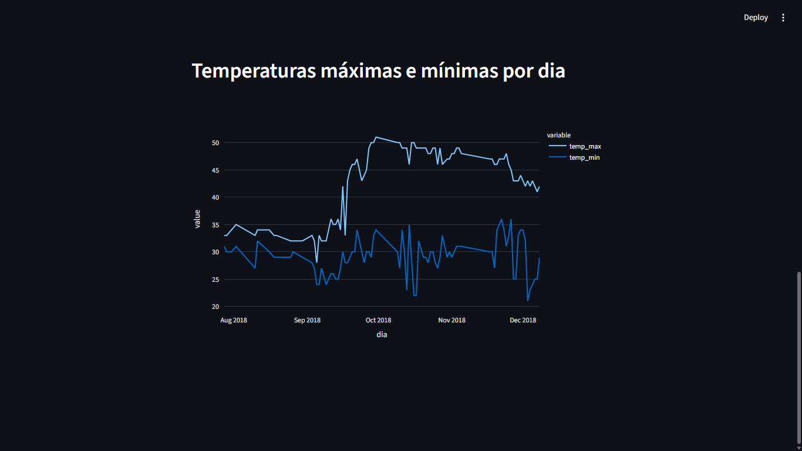

# Pipeline de Dados com IoT, Docker e PostgreSQL

## Descrição do Projeto

Este projeto implementa um pipeline de dados completo para processar leituras de temperatura de dispositivos IoT. Os dados são extraídos de um arquivo CSV (dataset público do Kaggle), transformados e carregados em um banco PostgreSQL rodando dentro de um contêiner Docker. Um dashboard interativo construído com Streamlit e Plotly permite visualizar métricas como média de temperatura por dispositivo, distribuição de leituras ao longo do dia e evolução temporal das temperaturas máximas e mínimas.

O objetivo é demonstrar na prática conceitos de Ingestão, Armazenamento, Processamento e Visualização de dados, seguindo boas práticas de arquitetura de dados para IoT.

## Tecnologias Utilizadas

```
* Ferramenta      X     # Finalidade
```
```
* Python 3.10+	        # Linguagem principal do pipeline e dashboard
* Pandas	            # Leitura, limpeza e transformação dos dados
* SQLAlchemy	        # Conexão e manipulação do banco de dados
* PostgreSQL	        # Banco de dados relacional para armazenamento
* Docker	            # Containerização do PostgreSQL
* Streamlit	            # Criação do dashboard interativo
* Plotly	            # Geração de gráficos dinâmicos
* Git/GitHub	        # Controle de versão e entrega do projeto
```

## Estrutura do Projeto

```
Disruptive-Architectures-IOT-Big-Data-e-IA/
│
├── data/
│   └── IOT-temp.csv                     # Dataset original
│
├── sql/
│   └── views.sql                        # Definição das views (opcional, pois o setup as cria)
│
├── src/
│   ├── setup_database.py                # Script de criação da tabela, carga dos dados e criação das views
│   └── dashboard.py                     # Aplicação Streamlit com os gráficos
│
├── docker-compose.yml                   # Orquestração do contêiner PostgreSQL
├── requirements.txt                     # Dependências Python
├── run.bat (Windows) / run.sh (Linux)   # Script de inicialização (plug-and-play)
└── README.md                            # Este arquivo
```

## Como Executar o Projeto

Pré‑requisitos:

* Docker e Docker Compose instalados
* Python 3.10+ instalado
* Git (opcional, para clonar o repositório)
* Baixe o dataset
```
    Acesse Temperature Readings: IoT Devices no Kaggle.
    Faça o download do arquivo IOT-temp.csv e coloque-o na pasta data/ do projeto.
```

### 1. Clonar o repositório

```
git clone https://github.com/Yuri-Melo123/Disruptive-Architectures-IOT-Big-Data-e-IA.git
cd Disruptive-Architectures-IOT-Big-Data-e-IA
```

### 2. Instalar dependências

```
pip install -r requirements.txt
```

### 3. Subir o PostgreSQL com Docker

```
docker-compose up -d
```

### 4. Executar o pipeline de dados (cria a tabela, carrega os dados e as views)

```
python src/setup_database.py
```

### 5. Rodar o dashboard

```
streamlit run src/dashboard.py
```
O dashboard abrirá automaticamente no seu navegador (endereço http://localhost:8501).

## Views Criadas

Três views foram implementadas no banco PostgreSQL para responder a perguntas de negócio:

### 🔹 Média de temperatura por dispositivo



* avg_temp_por_dispositivo
    - Permite identificar quais dispositivos apresentam maiores temperaturas médias.

```
SELECT room_id, AVG(temperature) as avg_temp
FROM temperature_readings
GROUP BY room_id;
```
Propósito: Mostrar a temperatura média de cada cômodo/dispositivo, permitindo identificar quais ambientes são naturalmente mais quentes ou mais frios. 

### 🔹 Leituras por hora



* leituras_por_hora 
    - Mostra o volume de dados coletados ao longo do dia.

```
SELECT EXTRACT(HOUR FROM noted_date) as hora, COUNT(*) as contagem
FROM temperature_readings
GROUP BY hora
ORDER BY hora;
```
Propósito: Revelar o volume de leituras ao longo das 24 horas do dia. Pode indicar períodos de maior atividade dos sensores ou horários de pico de monitoramento.

### 🔹 Temperaturas máximas e mínimas por dia



* temp_max_min_por_dia
    - Permite analisar variações térmicas diárias.

```
SELECT DATE(noted_date) as dia,
       MAX(temperature) as temp_max,
       MIN(temperature) as temp_min
FROM temperature_readings
GROUP BY dia
ORDER BY dia;
```
Propósito: Acompanhar a evolução diária das temperaturas extremas (máxima e mínima), útil para detectar tendências de aquecimento ou resfriamento ao longo do tempo.

## Insights Obtidos

* Identificação de dispositivos com comportamento anômalo
* Horários com maior atividade de sensores
* Variação térmica ao longo do tempo

## Possíveis Aplicações no Mundo Real

Monitoramento de data centers: Alertas automáticos quando a temperatura média de uma sala ultrapassar um limiar.

Agricultura de precisão: Sensores em estufas – análise de horários mais quentes para ativar irrigação ou ventilação.

Indústria 4.0: Rastreamento de temperatura em linhas de produção para garantir qualidade de produtos sensíveis.

## Dataset

Disponível em:
https://www.kaggle.com/datasets/atulanandjha/temperature-readings-iot-devices

## Comandos Git Utilizados

```
Comando	                        Descrição
git init	                    Inicializa o repositório local
git add .	                    Adiciona todos os arquivos ao staging
git commit -m "mensagem"	    Cria um commit com as alterações
git remote add origin <URL>	    Conecta o repositório local ao remoto (GitHub)
git push -u origin main	        Envia os commits para o GitHub
git pull	                    Atualiza o repositório local com mudanças do remoto
```

## Link para a explicação no Youtube

https://youtu.be/9LIQQWa-Nuw

## Licença

Este projeto é de uso educacional – sinta-se livre para usá-lo como referência em seus estudos.

Desenvolvido por Yuri de Oliveira Melo